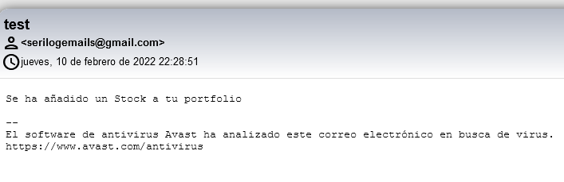

# Trading App

Esta aplicación consta de varias soluciones, que han sido desarrolladas durante el BootCapgemini de .Net en el cual hemos estado formandonos durante los primeros meses en Capgemini.

El proyecto consiste en un conjunto de proyectos cuya finalidad es crear una aplicación web que sirve como herramienta de gestión de Acciones, que permite tener un registro de las acciones que el usuario haya adquirido en diferentes plataformas.

El usuario podrá indicar, la acción adquirda, introducir su valor, el número de acciones que compró y la fecha de adquisición de dicha la misma.

**Trading App esta formado por:**
  
- Trading API (Back-End)
- Trading Client (Front-End)
- Email Reciber: Aplicación de consola para envio de correos de log
- MySQL: Base de datos alojada en un contenedor de docker, a la cual apunta nuestra Trading Api
- Alphavantage API: API externa a la cual se le solicitan los datos de las acciones para guardarlos en la base de datos anteriormente mencionada.

Trading API y Trading Client son dos proyectos diferentes que se conectan mediante peticiones Http Request, además se deployaran en diferentes contenedores de docker usando docker compose.

## Arquitectura

En estos proyectos se ha utilizado la arquitectura DDD *(Domain Driven Desing)*,principios SOLID, además de patrones de diseño como Repository Patern


Como podemos ver en la imagen la arquitectura DDD tiene **tres capas principales**:

- Capa de Dominio: En esta capa de encuentran las Domain Entities
- Capa de Infrastructura:  En esta capa se encuentran los repositorios, los modelos de los cuales ejecutaremos las migraciones y el contexto de Datos.
- Capa de apliación: Donde se encuentran los servicios. Es además donde ocurre las conexiones a APIs externas

En nuestra aplicación la Web Api se encuentra fuera de la capa de aplicación, los controladores de la misma son los que pasan la información a la capa de aplicación para que sea tratada por los servicios.

# Tecnologías Utilizadas

### Trading API

- ASP.NET Core 6.0
- ASP.NET Core Web API
- Docker
- Docker Compose
- MySQL
- Automapper
- Swagger
- SMTP
- RabbitMQ
- Http Client
- Serilog
- Entity Framework
- LinQ
- Paginado
- HealthCheck
- Fluent Validations

#### Patrones de diseño

- Repository Pattern
- Generic Repository
- Singleton
- Unit of Work

#### Seguridad

- XSS
- CORS
- Remove Headers

### Trading Client

- ASP.NET Core 6.0
- ASP.NET Core MVC
- Docker
- Docker Compose
- Automapper
- Http Client
- Serilog
- Entity Framework
- LinQ
- Razor
- Bootstrap
- Paginado
  
#### Patrones de diseño y Principios SOLID

- Singleton

### Configuración del entono

- Se debe tener Docker instalado

# Despliegue de la aplicación

Clonar repositorio y ejecutar una cmd dentro del directorio TradingApp (donde se encuentra el archivo docker-compose.yml)
Ejecutar el comando:
```
docker-compose up
```
Ahora podremos acceder a:

- [Swagger](http://localhost:7000/swagger/index.html)
- [Healthcheck](http://localhost:7000/Dashboard#/healthchecks)
- [WebClient](http://localhost:7001/)
  
# Funcionamiento

## Trading API

### Diagrama de componentes


### Comportamiento

Cuando arranca la aplicación, se ejecutan las migraciones pertinentes sin necesidad de usar la consola de administración de paquetes de Visual Studio

``` C#
public async Task ConfigureMigrations(IServiceProvider serviceProvider)
        {
            var context = serviceProvider.GetRequiredService<TradingDbContext>();
            await context.Database.MigrateAsync();
        }
```

Seguidamente lee la API de [alphavantage](https://www.alphavantage.co/documentation/) concretamente accede a un fichero CSV del cual extrae los datos de las acciones utilizando un CSVReader, haciendo una petición Http a esta URL:

```
https://www.alphavantage.co/query?function=LISTING_STATUS&apikey=demo
```
La API key se puede obtener de manera gratuita en esa misma página.

Después comprueba en la capa de aplicación el número de elementos recibidos en ese csv y lo compara con lo que tiene almacenado en base de datos, si no coinciden los conteos, se procede a eliminar la tabla de Acciones y se vuelven a insertar los datos con un Bulk Insert

``` C#
public async void InsertCsv(IEnumerable<Stock> stocks)
        {
            if (CheckStocks(stocks).Result == false)
            {
                string query = "Insert into Stocks (Symbol, Name) Values ";
                foreach (var stock in stocks)
                {
                    query += $"('{stock.Symbol}','{stock.Name}'),";
                }
                query = query.Remove(query.Length - 1, 1);
                await _unitOfWork.Context.Database.ExecuteSqlRawAsync(query);
        }
```

Como vemos en este fragmento de código ejecutamos el Insert de forma dinámica y concatenando a la query los valores obtenidos, además se comprueba con el método CheckStocks que la API no haya cambiando respecto a la base de datos.

Una vez obtiene todos estos datos, ya podemos acceder a [Swagger](http://localhost:7000/swagger/index.html) y comprobar el funcionamiento de la API

Cabe destacar que todas las consultas están paginadas desde la capa de Infraestructura, obteniendo las consultas paginadas en la API que pasarán paginadas al proyecto MVC, está es la respuesta que obtenemos de la API al ejecutar un **Get**

```JSON
{
  "pageNumber": 1,
  "pageSize": 3,
  "firstPage": "http://localhost:7000/api/Stock/Pagination?pageNumber=1&pageSize=3",
  "lastPage": "http://localhost:7000/api/Stock/Pagination?pageNumber=4118&pageSize=3",
  "totalPages": 4118,
  "totalRecords": 12353,
  "nextPage": "http://localhost:7000/api/Stock/Pagination?pageNumber=2&pageSize=3",
  "previousPage": null,
  "data": [
    {
      "name": "Agilent Technologies Inc",
      "symbol": "A"
    },
    {
      "name": "Alcoa Corp",
      "symbol": "AA"
    },
    {
      "name": "AAF FIRST PRIORITY CLO BOND ETF ",
      "symbol": "AAA"
    }
  ],
  "succeeded": true,
  "errors": [],
  "message": null
}
```
Podemos ver que la respuesta obtenida nos devuelve los valores que utilizaremos despues en la aplicación MVC para realizar el páginado y mostrar los datos.

Además tambien podemos añadir una Acción a nuestro Portfolio ejecutando el metodo POST de la api como realizaremos despues desde la aplicación MVC


Otra utilidad que nos da esta aplicación es el [Healthcheck](http://localhost:7000/Dashboard#/healthchecks), el cual nos muestra la salud de nuestra base de datos

También se ha creado un sistema de colas usando RabbitMQ en el cual se ponen en cola los correos no recibidos por el Email Sender, que contienen logs de la aplicación


 
 y cuando ejecutamos el Email Sender se envian por correo electrónico (Se utilizó SmtpClient)

 

En cuanto a seguridad como comentabamos en el apartado de las tecnologías utilizadas, se ha implementado el Middleware XSS cuando intenamos injectar codigo javascript en una petición POST: 

```JSON
{
  "amount": 1,
  "buyPrice": 1,
  "buyDate": <script></script>,
  "stock": {
    "name": "Test",
    "symbol": "Test"
  }
}
```

Recibimos esta respuesta:


Además se han eliminado las cabeceras de las respuestas en la API para que no aparezca el servidor en el que se están ejecutando


Y por último las fluent validations que te obligan a completar algunos de los campos en el método POST:

```JSON
Error: Bad Request
Response body
{
  "type": "https://tools.ietf.org/html/rfc7231#section-6.5.1",
  "title": "One or more validation errors occurred.",
  "status": 400,
  "traceId": "00-bccb9111e3c95125a7c5e749cbe66afa-0b9800c2bee36071-00",
  "errors": {
    "Amount": [
      "'Amount' must not be empty."
    ],
    "BuyPrice": [
      "'Buy Price' must not be empty."
    ]
  }
}
```

## Trading Client

### Diagrama de componentes


### Comportamiento

Esta aplicación muestra todos los datos que vienen desde la Trading Api mediante peticiones Http
El usuario podrá elegir un Stock de la lista y añadirlo a su Portfolio personal indicando, la fecha de compra, el número de Acciones adquiridas y el precio de compra.

Para implentar las vistas se usaron las vistas de Razor con los ViewModels correspondientes

Se generaron 2 vistas principales:

- **Stock** : Muestra la lista de Acciones paginada y deja al usuario añadir acciones a su cartera personal
- **Portfolio**: Muestra la lista de Portfolios

Para el páginado se ha utilizado la información proprocionada por la API para la asignación de las páginas mediante botones

```Html
<div>
   <nav aria-label="Page navigation">
  <ul class="pagination justify-content-center">
    <li class="page-item"><a class="page-link" href="@Model.FirstPage.Query"><i class="bi bi-chevron-bar-left"></i></a></li>
    <li class="page-item"><a class="page-link" href="@Model.PreviousPage?.Query"><i class="bi bi-chevron-compact-left"></i></a></li>
    <li class="page-item"><a class="page-link" href="@Model.NextPage?.Query"><i class="bi bi-chevron-compact-right"></i></a></li>
    <li class="page-item"><a class="page-link" href="@Model.LastPage.Query"><i class="bi bi-chevron-bar-right"></i></a></li>
  </ul>
</nav>
</div>
```

Además se implementó un desplegable para elegir el número de elementos
```Html
<div class="dropdown text-end">
  <button class="btn btn-outline-secondary btn-sm dropdown-toggle" type="button" id="dropdownMenuButton1" data-bs-toggle="dropdown" aria-expanded="false">
    Showing Elements : @Model.PageSize
  </button>
  <ul class="dropdown-menu" aria-labelledby="dropdownMenuButton1">
    <li><a class="dropdown-item" asp-controller="Stock" asp-action="Index" asp-route-pageNumber ="@Model.FirstPage" asp-route-pageSize="15">15</a></li>
    <li><a class="dropdown-item" asp-controller="Stock" asp-action="Index" asp-route-pageNumber ="@Model.FirstPage" asp-route-pageSize="50">50</a></li>
    <li><a class="dropdown-item" asp-controller="Stock" asp-action="Index" asp-route-pageNumber ="@Model.FirstPage" asp-route-pageSize="100">100</a></li>
  </ul>
</div>
```

# Docker

Podriámos ejecutar comandos dentro de nuestro docker-container para leer el fichero de logs que se crea desde la api.

```
docker container exec -it tradingapp-api-1 /bin/bash
```

```
drwxr-xr-x  2 root root    4096 Feb 11 00:25 logs
drwxr-xr-x 18 root root    4096 Feb 10 21:27 runtimes
-rw-r--r--  1 root root     494 Feb 10 21:27 web.config
root@4d2f12089ad1:/app# cd logs/
root@4d2f12089ad1:/app/logs# cat 11-02-2022.txt
2022-02-11 00:25:51.346 +00:00 [INF] No ha habido cambios en la base de datos 02/11/2022 00:25:51
2022-02-11 00:25:51.444 +00:00 [INF] Initializing UI Database
2022-02-11 00:25:51.531 +00:00 [INF] Entity Framework Core 6.0.1 initialized 'HealthChecksDb' using provider 'Microsoft.EntityFrameworkCore.InMemory:6.0.0' with options: StoreName=HealthChecksUI
2022-02-11 00:25:51.567 +00:00 [INF] Saving healthchecks configuration to database
2022-02-11 00:25:51.641 +00:00 [INF] Saved 1 entities to in-memory store.
2022-02-11 00:25:51.663 +00:00 [INF] Now listening on: http://[::]:80
2022-02-11 00:25:51.686 +00:00 [INF] Entity Framework Core 6.0.1 initialized 'HealthChecksDb' using provider 'Microsoft.EntityFrameworkCore.InMemory:6.0.0' with options: StoreName=HealthChecksUI
2022-02-11 00:25:51.717 +00:00 [INF] Start processing HTTP request GET "http://api/health"
2022-02-11 00:25:51.718 +00:00 [INF] Sending HTTP request GET "http://api/health"
```

Tambien podriamos ver las variables de entorno usando el comando:
```
env
```

```
root@4d2f12089ad1:/app# env
Logging__Console__FormatterName=Json
HOSTNAME=4d2f12089ad1
ASPNETCORE_ENVIRONMENT=Production
DOTNET_VERSION=6.0.1
ASPNETCORE_URLS=http://+:80
PWD=/app
HOME=/root
TERM=xterm
SHLVL=1
ASPNET_VERSION=6.0.1
DOTNET_RUNNING_IN_CONTAINER=true
PATH=/usr/local/sbin:/usr/local/bin:/usr/sbin:/usr/bin:/sbin:/bin
_=/usr/bin/env
OLDPWD=/app/logs
root@4d2f12089ad1:/app#
```

Estas variables están definidas en mi docker-compose